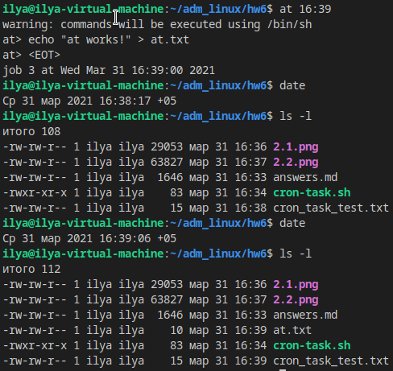
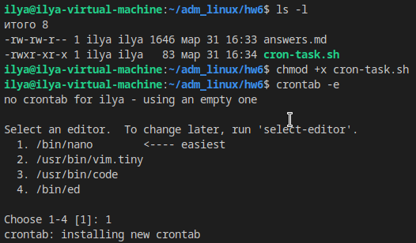
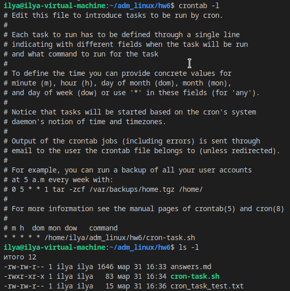
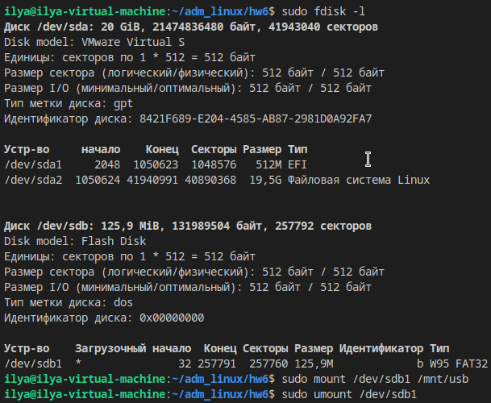

# Вопросы
1) Какая команда позволяет установить задания планировщика?
    ```
    at <time> <date>
    crontab -e <command>
    ```	
2) Что сделает Команда atrm 7?  
    удалит задачу с номером 7
3) Какая команда позволяет установить планировщику crontab задания из файла jobs?
    ```
    crontab jobs
    ```
4) Когда будет готово задание 19 */2 13 * 5 job.sh ?  
    по пятницам 13-го числа на 19-й минуте каждого чётного часа
5) Напишите cron строку установленной на выполнение скрипта job.sh с января по май, в 01:00 по воскресеньям
    ```
    0 1 * 1-5 7 job.sh  
    ```
6) Просмотреть список всех смонтированных разделов можно командой?
    ```
    mount
    ```
7) описать работу vim (выход, сохранение, поиск, замена строк, удаление строк (полностью частично))
    * `:q` - выход 
    * `:w` - сохранение
    * `/search` - поиск
    * `:%s/search/replace/g` - замена строк 
    * `d` - удалить символ
    * `dd` - удалить всю строку
    * `D` - удалить символы начиная от курсора и до конца строки

# Практика
1) at  
    
2) crontab  
    
    
3) mount
    
